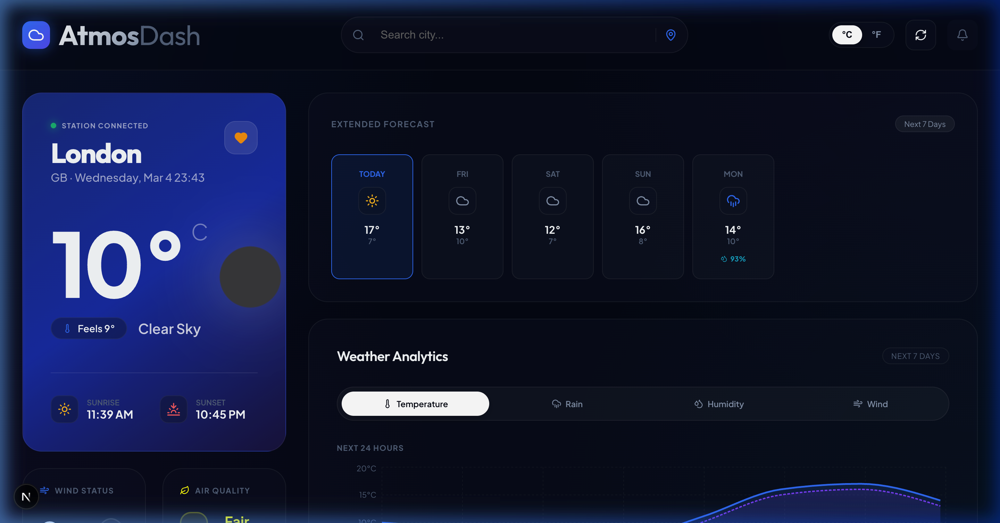
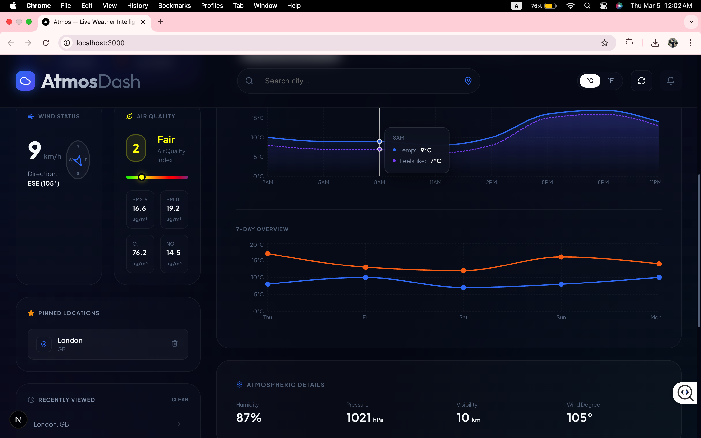
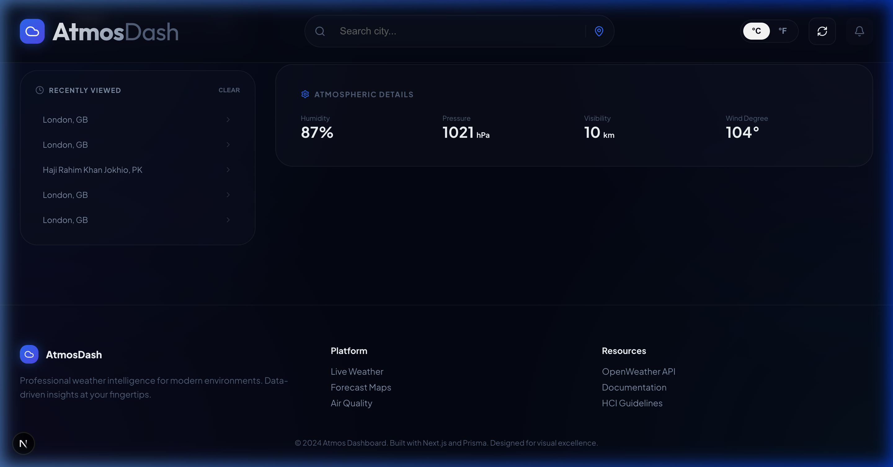

<p align="center">
  
  
  
  
  
</p>

<h1 align="center">🌤️ Atmos — Live Weather Dashboard</h1>

<p align="center">
  A real-time weather dashboard with live forecasts, air quality monitoring, interactive charts, and city search — built with Next.js, Prisma, and the OpenWeatherMap API.
</p>

<p align="center">
  <a href="#screenshots">Screenshots</a> •
  <a href="#features">Features</a> •
  <a href="#tech-stack">Tech Stack</a> •
  <a href="#getting-started">Getting Started</a> •
  <a href="#project-structure">Project Structure</a> •
  <a href="#hci-principles">HCI Principles</a>
</p>

---

## Screenshots

### Dashboard — Live Weather & 7-Day Forecast

<p align="center">
  
</p>

### Weather Analytics, Wind & Air Quality

<p align="center">
  
</p>

### Atmospheric Details, Search History & Footer

<p align="center">
  
</p>

---

## Features

- **Live Weather** — Current temperature, feels-like, humidity, wind speed, visibility, and pressure via OpenWeatherMap API
- **7-Day Forecast** — Daily high/low temperatures, weather icons, and precipitation probability
- **24-Hour Hourly Charts** — Temperature, humidity, wind, and rain chance visualized with Recharts
- **Air Quality Index** — Real-time AQI with PM2.5, PM10, O₃, NO₂ pollutant levels
- **Wind Compass** — Wind speed and direction with an animated compass
- **City Search with Autocomplete** — Debounced search with OpenWeatherMap geocoding API results
- **Geolocation** — One-click browser geolocation to get weather for your current position
- **Favorites** — Save cities to a PostgreSQL database and quickly switch between them
- **Search History** — Automatically tracks recently searched cities in the database
- **Unit Toggle** — Switch between °C and °F
- **Responsive Design** — Works on desktop and mobile screens
- **Fallback Mock Data** — If the API key is missing, the dashboard shows demo data so the UI is still explorable

---

## Tech Stack

| Layer       | Technology                               | Version |
| ----------- | ---------------------------------------- | ------- |
| Framework   | Next.js (App Router, Turbopack)          | 16.1.6  |
| Language    | TypeScript                               | 5.9.3   |
| Database    | PostgreSQL                               | 16      |
| ORM         | Prisma (with `@prisma/adapter-pg`)       | 7.4.2   |
| Charts      | Recharts                                 | 3.7.0   |
| Icons       | Lucide React                             | —       |
| HTTP        | Axios                                    | 1.13.6  |
| Dates       | date-fns                                 | 4.1.0   |
| Weather API | OpenWeatherMap                           | —       |
| Fonts       | Plus Jakarta Sans, Outfit (Google Fonts) | —       |
| Styling     | Vanilla CSS with Custom Properties       | —       |

---

## Getting Started

### Prerequisites

- Node.js 18+
- PostgreSQL 16 (`brew install postgresql@16` on macOS)
- OpenWeatherMap API key — [get one free here](https://openweathermap.org/appid)

### 1. Clone

```bash
git clone https://github.com/wajihacodeofficial/Atmos-Live-Weather-Dashboard.git
cd Atmos-Live-Weather-Dashboard
```

### 2. Install

```bash
npm install
```

### 3. Environment Variables

Create `.env.local` in the project root:

```env
DATABASE_URL="postgresql://YOUR_USER@localhost:5432/weather_dashboard"
NEXT_PUBLIC_OPENWEATHER_API_KEY=your_api_key_here
```

### 4. Database Setup

```bash
createdb weather_dashboard
npx prisma db push
npx prisma generate
```

### 5. Run

```bash
npm run dev
```

Open [http://localhost:3000](http://localhost:3000).

> If no API key is configured, the dashboard runs in demo mode with sample data.

---

## Project Structure

```
src/
├── app/
│   ├── api/
│   │   ├── weather/route.ts      # GET current weather (with caching)
│   │   ├── forecast/route.ts     # GET 7-day + hourly forecast + AQI
│   │   ├── favorites/route.ts    # GET/POST/DELETE favorite cities
│   │   └── history/route.ts      # GET/POST/DELETE search history
│   ├── globals.css               # Design tokens & component styles
│   ├── layout.tsx                # Root layout with metadata
│   └── page.tsx                  # Main dashboard page
├── components/
│   ├── HeroCard.tsx              # Main weather display card
│   ├── ForecastCard.tsx          # 7-day forecast grid
│   ├── WeatherCharts.tsx         # Recharts analytics (4 tabs)
│   ├── AirQualityCard.tsx        # AQI indicator + pollutant grid
│   ├── WindCard.tsx              # Wind speed + compass
│   ├── SearchBar.tsx             # Autocomplete search + geolocation
│   └── SidePanel.tsx             # Favorites + search history
├── lib/
│   ├── weather.ts                # OpenWeatherMap API calls
│   └── prisma.ts                 # Prisma client singleton
├── hooks/
│   └── useDebounce.ts            # Debounced callback hook
└── prisma/
    └── schema.prisma             # Database models
```

---

## Database Models

Three tables stored in PostgreSQL via Prisma:

- **SearchHistory** — Logs every city search with coordinates and timestamp
- **FavoriteCity** — Stores pinned cities (unique per city + country)
- **WeatherCache** — Caches API responses with expiration time to reduce API calls

---

## HCI Principles

This project applies Nielsen's usability heuristics:

| Heuristic                     | How It's Applied                                                             |
| ----------------------------- | ---------------------------------------------------------------------------- |
| Visibility of System Status   | "Station Connected" indicator, loading spinner on refresh, error messages    |
| Match with Real World         | Weather icons, compass for wind direction, sunrise/sunset times              |
| User Control & Freedom        | Unit toggle (°C/°F), clear history, remove favorites, cancel search          |
| Consistency                   | Uniform glassmorphism cards, consistent typography, same icon set throughout |
| Error Prevention              | API fallback to mock data, input debouncing, graceful error handling         |
| Recognition over Recall       | Favorites panel, recent searches, autocomplete suggestions                   |
| Flexibility                   | Keyboard search, geolocation shortcut, click history to re-search            |
| Aesthetic & Minimalist Design | Dark theme, clean hierarchy, no clutter                                      |

---

<p align="center">
  Built by <a href="https://github.com/wajihacodeofficial">Wajiha Zehra</a>
</p>
